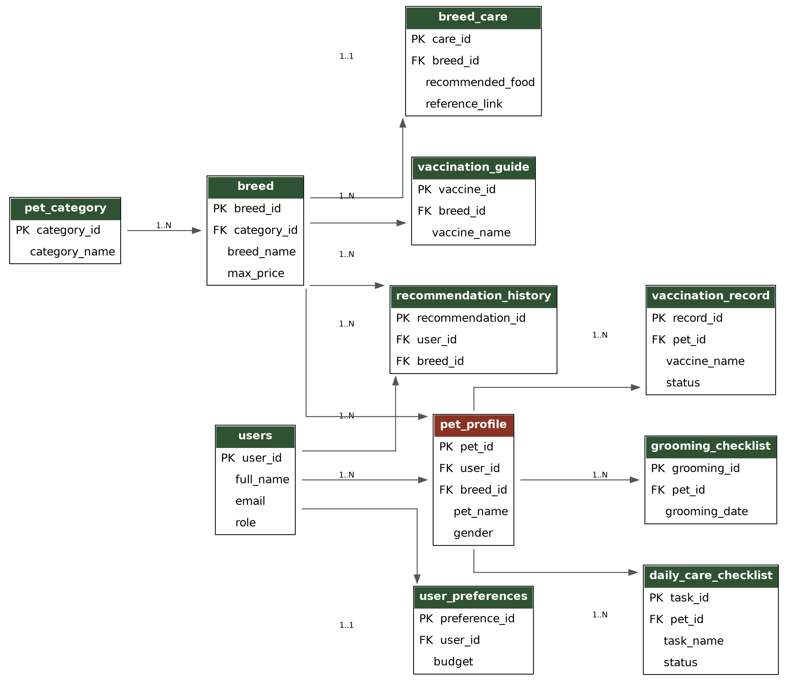
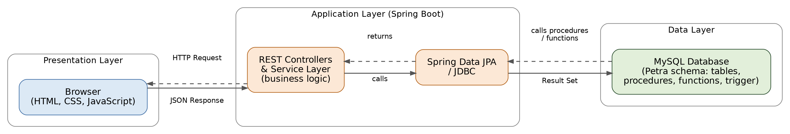

# petra-pet-tracking-and-recommendation-system

Petra is a relational database project that helps pet owners manage the complete lifecycle of pet ownership — from adoption through daily care — and helps prospective owners find a breed that fits their lifestyle. The current implementation covers the **database layer**, built entirely in **MySQL**, and is designed to be extended into a full-stack web application using **Java with Spring Boot** on the backend and **HTML, CSS, and JavaScript** on the frontend.

## Overview

Petra centralizes information that pet owners would otherwise track across scattered notes and memory: breed details, vaccination schedules, grooming routines, daily care tasks, and personalized breed recommendations based on lifestyle factors like house type, budget, climate, and prior pet-owning experience.

## Features

- **User Management** – accounts, roles (admin/user), and account status
- **Pet Profile Management** – individual pet records linked to owners and breeds
- **Breed Information** – a catalog of breeds across dog, cat, bird, rabbit, and fish categories
- **Breed Care Guide** – feeding, grooming, and maintenance guidance per breed
- **Vaccination Guide** – standard vaccination schedules per breed
- **Vaccination Records** – actual vaccination history per pet
- **Grooming Checklist** – grooming history and next due dates per pet
- **Daily Care Checklist** – recurring daily tasks (feeding, walking, cleaning, etc.)
- **User Preferences** – lifestyle profile used to drive breed recommendations
- **Breed Recommendation History** – a log of past recommendations and their reasoning

## Tech Stack

| Layer | Technology |
|---|---|
| Database | MySQL |
| Application (planned) | Java (Spring Boot) |
| Frontend (planned) | HTML, CSS, JavaScript |

## Entity Relationship Diagram



## System Architecture



Planned three-tier flow: a browser (HTML/CSS/JavaScript) sends requests to a Spring Boot REST API. Controllers and service classes apply business logic, and Spring Data JPA / JDBC communicates with the MySQL database — invoking the stored procedures and functions already implemented in `petra_database.sql` — before returning JSON back to the browser.

## Database Schema

The schema consists of 11 tables:

| Table | Purpose |
|---|---|
| `users` | Account information for admins and standard users |
| `pet_category` | High-level pet categories (Dog, Cat, Bird, Rabbit, Fish) |
| `breed` | Breed-level details within each category |
| `breed_care` | One-to-one care guide per breed |
| `vaccination_guide` | Standard vaccination schedule per breed |
| `pet_profile` | An individual pet, linked to its owner and breed |
| `vaccination_record` | Actual vaccination history per pet |
| `grooming_checklist` | Grooming history per pet |
| `daily_care_checklist` | Recurring daily care tasks per pet |
| `user_preferences` | A user's lifestyle profile for recommendations |
| `recommendation_history` | Log of breed recommendations made to users |

## Database Concepts Implemented

- Schema design with `PRIMARY KEY`, `FOREIGN KEY`, `UNIQUE`, and `CHECK` constraints
- `ALTER TABLE` operations: adding, dropping, renaming, and modifying columns
- Aggregate functions (`COUNT`, `SUM`, `AVG`, `MIN`, `MAX`) with `GROUP BY` / `HAVING`
- `INNER JOIN`, `LEFT JOIN`, and `RIGHT JOIN` across multiple tables
- Two **stored procedures**: `GetPetDetailsByUser`, `GetVaccinationHistory`
- Two **functions**: `TotalPets`, `AveragePetWeight`
- One **trigger**: `CheckPetAge` (prevents negative pet ages on insert)
- 15 scenario-based queries covering realistic use cases (overdue vaccinations, multi-pet owners, budget-based filtering, etc.)

## Getting Started

1. Install MySQL (or MariaDB) locally, or use MySQL Workbench.
2. Run the script:
   ```bash
   mysql -u root -p < petra_database.sql
   ```
3. The script creates the database, all tables, sample data, stored procedures, functions, the trigger, and runs all demo/scenario queries end to end.

> Note: the script ends with an intentional invalid `INSERT` (a negative pet age) used to demonstrate the `CheckPetAge` trigger. This is expected to raise an error — it confirms the trigger is working correctly and does not affect any other statement in the script.

## Future Scope

- **Java Spring Boot integration** – application layer exposing REST APIs, connecting to MySQL via Spring Data JPA / JDBC, invoking the existing stored procedures and functions
- **Web frontend** – HTML/CSS/JavaScript UI consuming data from the backend
- **Authentication** – secure login using the existing `users` table (password hashing, role-based access)
- **Admin dashboard** – breed/care/vaccination management and system-wide analytics
- **Recommendation engine** – automated breed matching using `user_preferences` and `recommendation_history`
- **Notification system** – scheduled alerts for overdue vaccinations, grooming, and daily care tasks

## Author

Sowmiya
